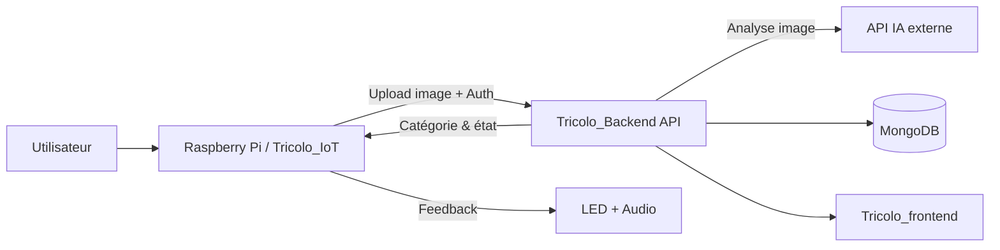

# Tricolo — Plateforme IoT de tri intelligent des déchets


##  À propos

**Tricolo** est un projet IoT de tri des déchets composé de 3 briques :

- un **système embarqué** (Raspberry Pi) qui capture et envoie des images de déchets ;
- un **backend** qui gère l’API, la persistance, la logique métier et l’analyse IA ;
- un **frontend** qui affiche les données, statistiques et états des bacs.

Le dépôt actuel est le **repository parent** qui assemble ces composants via des **Git submodules**.

---

##  Sous-modules du projet

| Module | Rôle | Lien |
|---|---|---|
| `Tricolo_IoT` | Capture photo, interaction matérielle (bouton, LED, capteur), envoi vers API backend, retour audio/visuel | [Andylamothe/Tricolo_IoT](https://github.com/Andylamothe/Tricolo_IoT) |
| `Tricolo_Backend` | API Node/TypeScript, auth, stockage MongoDB, endpoints IoT & frontend, analyse d’image via API IA externe (Gemini) | [Andylamothe/Tricolo_Backend](https://github.com/Andylamothe/Tricolo_Backend) |
| `Tricolo_frontend` | Interface React/Vite (dashboard), affichage des données de tri, statistiques, monitoring des bacs | [Andylamothe/Tricolo_frontend](https://github.com/Andylamothe/Tricolo_frontend) |

---

##  Vue d’ensemble fonctionnelle

1. L’utilisateur dépose un déchet et déclenche la borne IoT.
2. Le module IoT capture une image et l’envoie au backend.
3. Le backend analyse l’image via une API externe d’IA, puis détermine la catégorie.
4. Le backend enregistre les données (déchet, date, vérification, statistiques, notifications).
5. Le frontend consomme les endpoints backend pour afficher l’état système en temps réel et l’historique.
6. Le module IoT récupère la catégorie, guide l’utilisateur (LED + audio) et valide la destination du déchet.

---

##  Architecture (haut niveau)



---

##  Démarrage rapide (repo parent)

```bash
git clone https://github.com/Andylamothe/Tricolo.git
cd Tricolo
git submodule update --init --recursive
```

Ensuite, lancez chaque module selon sa documentation propre :

- `Tricolo_IoT/README.md`
- `Tricolo_Backend/README.md`
- `Tricolo_frontend/README.md`

---

##  Collaborateurs

Contributeurs identifiés à partir de l’historique Git du projet et des sous-modules :

- **Andy Lamothe** (mainteneur principal)
- **Samuel Robillard**
- **Bradley Leneus**
- **Alexandre Rusenov**

Contributions automatisées (bots) observées dans l’historique :

- `copilot-swe-agent[bot]`
- `vercel[bot]`

---

##  Photos du projet

### Frontend (dashboard)


### Projet (borne / démonstration)


### Équipe


---

##  Licence

Ce dépôt est distribué sous licence **MIT**. Voir [`LICENSE`](./LICENSE).
